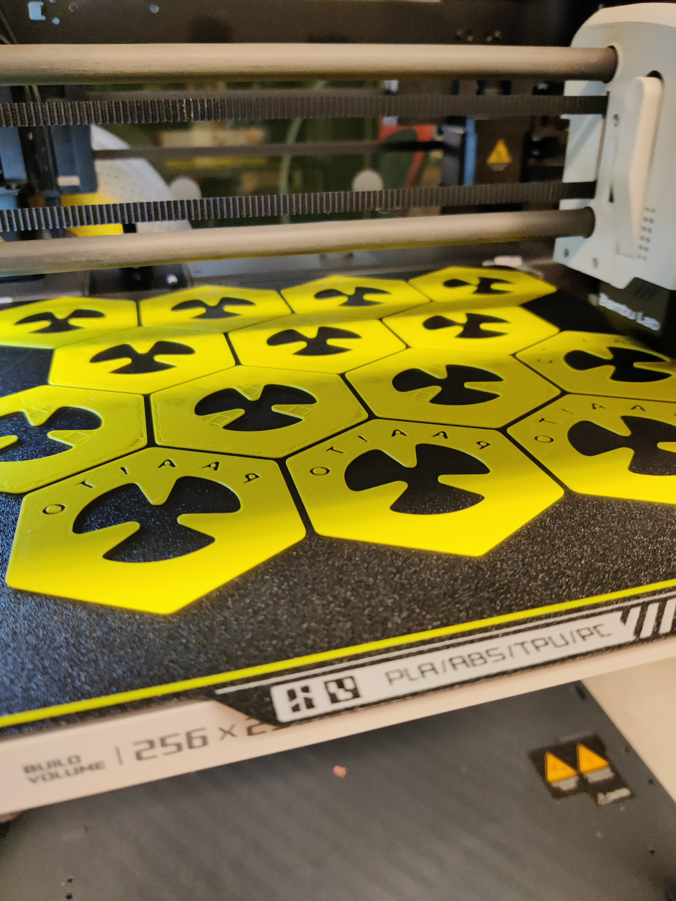

The Avocado Boat was designed to hold an avocado pit and float on top of water, allowing many boats to be placed in one large container and left unattended for long periods of time before needing to refill the water.

The pieces were designed in CAD and 3D printed through several iterations to refine the form and function. A hand-drawn instructional zine accompanies the boats, explaining how to grow your own avocado plant.

The boats were sold during an artist market, and they have been very successful at helping avocado pits sprout. There are now more avocado plants than expected. Would you like to adopt one, or maybe four?

{/* Long backstory:

I started growing avocados in my office in San Francisco because I had a steady supply of pits from my coworkers making avocado toast. I ended up growing about 100 of them on my desk. When we moved offices, they made a rule that no plants were allowed on desks, I was the reason that rule was made. So when we moved, I potted them all and had my coworkers adopt them. 

While I was at Space 21, an event called Smoothies and Movies regularly used avocados, so I began collecting the pits destined for garbage and growing them. I used the good ol' toothpick method to start, but my brain had been itching on this problem for 5 years now, that there must be a way to grow them without poking sticks through them (bacteria can harm the pit easier). I tried using cork tops as floaties, or cutting pool noodles and foam, but it didn't work well. I tried printing stands for them that they could sit on, they didn't balance well. I printed a holder that sat inside the cup, but I still had the issue of refilling the water every week or so. 

Then it hit me that I could make a boat for them to float on top of the water and place many of them in a big container. I did a quick CAD design in Fusion360 and printed one to test. I chose a hexagon design so I can fit the maximum in a container for growing. The first one sunk, it was too small to support a large avocado pit, so I made them larger and changed the area for the pit to sit in so it could hold small pits as well. 

   */}